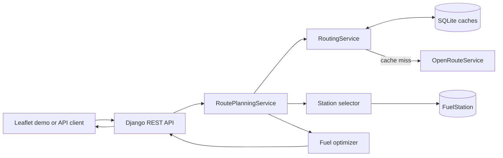
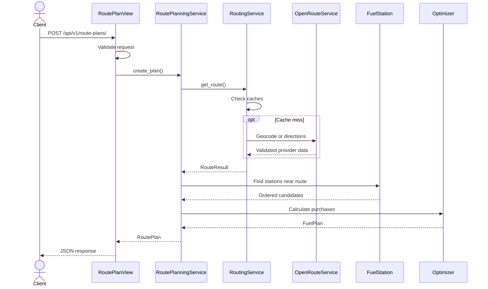

# Project Architecture

This is a practical guide to the Fuel Route Optimizer. It covers the main
decisions and request flow without repeating the source code.

## What the project does

The application takes a start and destination in the contiguous United States
and returns a driving route, sensible fuel stops, gallons to buy, and estimated
fuel cost.

It can be used through:

- The JSON API at `POST /api/v1/route-plans/`.
- The Leaflet demo at `/`.

The demo only displays backend results. It does not calculate routes, choose
stations, or calculate fuel costs in JavaScript.

## Big picture



The project is split into three main areas:

- `config` contains settings, root URLs, health checks, and the demo page.
- `fuel` owns station data, CSV import, GeoNames matching, and station
  selection.
- `routing` owns the API, OpenRouteService integration, caches, and optimizer.

Views deal with HTTP, while services hold the application logic. This keeps the
business rules testable without running a web server.

## Why these choices

### SQLite

The normalized dataset has about 6,600 stations, so SQLite is a good fit for
this assessment. It requires no separate database server, supports migrations
and transactions, and also stores the route caches.

PostgreSQL/PostGIS would be a better choice for a larger dataset, high
concurrency, or real spatial queries.

### OpenRouteService

OpenRouteService provides both geocoding and driving directions on a free tier.
A cold request normally uses two geocoding calls and one directions call.

### GeoNames

The CSV has no coordinates. GeoNames lets the import process resolve city/state
pairs from a downloadable dataset instead of geocoding thousands of stations.
The tradeoff is that these are city-centroid coordinates, not exact pumps.

### Docker

Docker gives reviewers a repeatable environment. The image runs as a non-root
user, and Docker Compose stores SQLite in a named volume.

## Code layout

```text
config/
    settings.py       Django, database, API, cache, and ORS settings
    urls.py           Root URL configuration
    views.py          Health endpoint and demo view
    templates/        Leaflet demo

fuel/
    models.py         FuelStation model
    services/
        importer.py   CSV and GeoNames import
        stations.py   Route-corridor station selection
    management/commands/import_fuel_prices.py

routing/
    models.py         GeocodeCache and RouteCache
    serializers.py    API contracts
    views.py          Endpoint and HTTP error mapping
    types.py          Internal immutable data objects
    services/
        openrouteservice.py
        routing.py
        planning.py
        optimizer.py

tests/                Unit and integration tests
```

## Database models

### `FuelStation`

One row represents one normalized OPIS station. It stores:

- OPIS truckstop ID.
- Name, address, city, state, and rack ID.
- Median retail price.
- Number of source observations.
- Optional latitude and longitude.
- Coordinate accuracy (`city_centroid` or `unmatched`).
- Created and updated timestamps.

The OPIS ID is unique. Latitude and longitude must either both exist or both be
null. There is a `(state, city)` index, but no spatial index.

### `GeocodeCache`

Stores a normalized location query, resolved label, coordinates, provider, and
expiry. The default TTL is 30 days.

### `RouteCache`

Stores endpoint coordinates, route GeoJSON, distance, duration, provider
profile, and expiry. The default TTL is 7 days.

The models have no foreign keys because stations and cache entries have
different lifecycles.

## Fuel import

Run:

```bash
python manage.py import_fuel_prices
```

The command:

1. Downloads or reuses the GeoNames U.S. ZIP.
2. Builds a coordinate lookup by normalized city and state.
3. Reads the assessment CSV with UTF-8 BOM support.
4. Checks required columns and validates each row.
5. Keeps recognized U.S. state codes.
6. Normalizes whitespace and state casing.
7. Groups observations by OPIS ID.
8. Rejects IDs that refer to conflicting physical stations.
9. Calculates the median price and source-row count.
10. Matches city/state values to GeoNames.
11. Validates and bulk-writes stations inside a transaction.

The import is idempotent. Partial imports keep existing stations unless
`--replace` is explicitly supplied.

The supplied file produces 6,626 normalized stations. GeoNames matches 6,619;
seven remain without coordinates.

## Route request flow



The request serializer validates the locations and optional initial-fill price.
The generated response is also validated by a serializer before being returned.

## Routing

The ORS client uses the `driving-car` profile with:

- 3-second connection timeout.
- 15-second read timeout.
- One retry after 0.25 seconds for transport errors and HTTP 502/503/504.

Geocoding results must include an explicit U.S. country code and coordinates
inside the supported contiguous-U.S. bounds.

Directions must contain a GeoJSON `LineString`, at least two valid coordinate
pairs, and finite positive distance and duration values.

Provider failures become domain exceptions, allowing the API to distinguish
rate limits, bad credentials, unavailable routing, and invalid responses.

## Station selection

Long route geometry is downsampled to roughly 1,000 points. A padded
latitude/longitude query first narrows the station set. Each remaining station
is projected onto the closest route segment.

Stations farther than 10 miles from the route are removed by default. The rest
are sorted by route mile, price, and station ID.

This is fast enough for the current dataset, but it is still an approximation
because coordinates are city centroids.

## Fuel optimizer

Current assumptions:

- 10 MPG.
- 50-gallon tank.
- 500-mile range.
- Full starting tank.
- No destination reserve.
- No detour fuel.

At each station, the optimizer looks for the first strictly cheaper station
reachable with one tank.

- If one exists, it buys only enough to reach it.
- If the destination is reachable, it buys only enough to finish.
- Otherwise, it fills toward capacity.

If a required gap cannot be completed, `NoFeasibleFuelPlan` is returned with
the failed route span.

The vehicle always starts full. By default, that fuel is treated as already
owned. Enabling `include_initial_fill` adds 50 gallons at the supplied starting
price to the reported cost, but does not change stop selection.

The worst-case optimizer complexity is `O(n²)`, which is acceptable for the
small number of route candidates.

## Caching

Geocode key:

```text
openrouteservice|geocode|us|v2|<normalized query>
```

Route key:

```text
openrouteservice|route|driving-car|v2|
<start lon>,<start lat>-><finish lon>,<finish lat>
```

The route key is directional.

Typical provider usage:

- Cold request: three provider calls.
- Fully cached request: zero calls.
- Fresh geocodes with an expired route: one call.

Expired rows are ignored and replaced on the next request. There is currently
no scheduled cache cleanup.

## API and demo

Main URLs:

- `/` — Leaflet demo.
- `/api/v1/route-plans/` — route-planning API.
- `/health/` — health check.
- `/api/schema/` — OpenAPI schema.
- `/api/docs/` — Swagger.
- `/api/redoc/` — ReDoc.

The demo uses a Django template, vanilla JavaScript, Leaflet 1.9.4, and
OpenStreetMap tiles. It sends start and finish values to the API, draws the
returned GeoJSON, adds markers, and displays the backend's trip summary.

Popup values are inserted with `textContent`, not untrusted HTML. The page has
no fuel or routing business logic.

## Error handling

| Status | Meaning |
|---:|---|
| 400 | Invalid request, malformed JSON, or location not found. |
| 422 | No fuel plan satisfies the 500-mile range. |
| 429 | Provider quota or rate limit. |
| 502 | Provider/network failure or invalid route response. |
| 503 | Routing credentials are missing or invalid. |
| 500 | Unexpected Django/application failure. |

Expected application failures use the documented `error` envelope. Generic DRF
errors such as unsupported methods keep DRF's normal `detail` response.

## Testing

Tests cover:

- Import normalization, duplicate medians, and coordinate matching.
- Model constraints and safe replacement.
- Cache hits, misses, and expiry.
- Provider retries, rate limits, and malformed responses.
- Station projection and corridor filtering.
- Greedy purchases and infeasible gaps.
- API success and error behavior.
- Environment loading and documentation URLs.
- Demo-page rendering.

ORS calls are mocked with `httpx.MockTransport`, so tests do not consume quota.

## Docker

The Dockerfile builds wheels in one stage and installs them into a clean runtime
image. The runtime runs as a non-root user, stores SQLite under `/data`, exposes
a health check, and starts Gunicorn.

Compose bind-mounts the source for development and persists `/data` in the
`sqlite_data` volume. Migrations and import remain explicit:

```bash
docker compose exec web python manage.py migrate
docker compose exec web python manage.py import_fuel_prices
```

## Security and performance

Useful safeguards:

- Secrets are read from ignored environment files.
- Placeholder ORS keys fail a Django system check.
- Provider data is validated before caching.
- The container runs as a non-root user.
- Frontend popup content is rendered as text.
- Persistent caches reduce provider traffic.

Current tradeoffs:

- No API authentication or throttling.
- SQLite is not suitable for heavy concurrent writes.
- No spatial database index.
- Concurrent cache misses are not coalesced.
- Health checks do not verify the database or provider.
- Dependencies are not lockfile-pinned.

## Known limitations

- City-centroid coordinates rather than exact stations.
- No road detour, traffic, tax, or station-hours model.
- One routing provider.
- Fixed MPG and tank capacity.
- Static assessment fuel prices.
- No automatic cache pruning.
- Demo assets and map tiles require internet access.
- No monitoring, CI/CD, or background workers.

## Possible next steps

1. Move spatial data to PostgreSQL/PostGIS.
2. Import exact station coordinates.
3. Add authentication and throttling.
4. Use Redis for shared caching and miss locking.
5. Run imports and cleanup as background jobs.
6. Add logging, metrics, tracing, and readiness checks.
7. Add provider failover.
8. Add CI, dependency locking, and deployment automation.

## Important files

| File | Responsibility |
|---|---|
| `config/settings.py` | Django and runtime configuration. |
| `config/urls.py` | Root URL routing. |
| `config/views.py` | Health and demo views. |
| `config/templates/config/route_planner_demo.html` | Leaflet frontend. |
| `fuel/models.py` | Station model and coordinate rules. |
| `fuel/services/importer.py` | CSV and GeoNames import. |
| `fuel/services/stations.py` | Station selection near a route. |
| `routing/services/openrouteservice.py` | ORS calls and validation. |
| `routing/services/routing.py` | Cache-aware route retrieval. |
| `routing/services/planning.py` | Request orchestration. |
| `routing/services/optimizer.py` | Fuel-purchase algorithm. |
| `routing/models.py` | Persistent cache models. |
| `routing/serializers.py` | API contracts. |
| `routing/views.py` | Endpoint and error mapping. |
| `tests/` | Automated regression coverage. |
